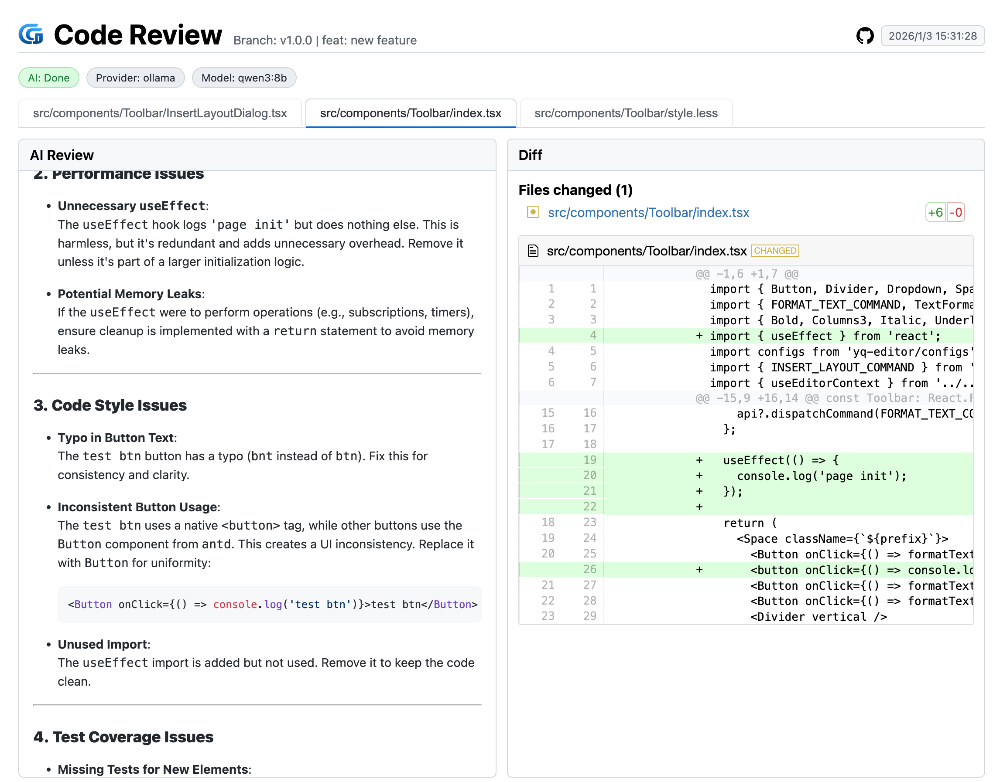
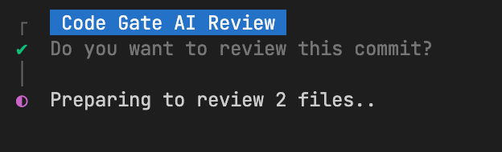
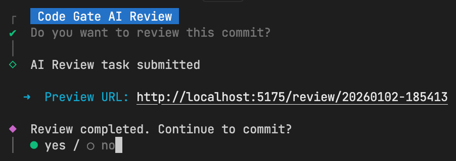

<div align="center">
  
</div>

[English](./README.md) | [简体中文](./README_ZH.md)

# Code Gate

**Your Lightweight Local AI Code Review Assistant**

Code Gate is an intelligent code review tool seamlessly integrated into your Git workflow. When you run `git commit`, it automatically analyzes staged code changes, utilizing local LLMs (Ollama) or cloud AI services to provide instant feedback on code quality, security suggestions, and optimization plans.

<div align="left">
  
</div>

## ✨ Features

- **🔒 Privacy First**: Native support for Ollama local models. 
- **☁️ Multi-Model Support**: Seamlessly integrates with DeepSeek, OpenAI, Anthropic, Aliyun Qwen, Doubao, and more.
- **🌍 Multi-Language**: Built-in support for English, Chinese (Simplified & Traditional), Japanese, Korean, German, and French.
- **⚡️ High Performance**: Intelligent concurrent processing for faster reviews across multiple files.
- **🛠️ Highly Customizable**: Custom prompts, file filtering rules, and review strategies.
- **📊 Visual Reports**: Generates intuitive HTML review reports with clear diffs and AI suggestions.
- **📜 Review Logs**: Automatically archives review history for easy reference and tracking.

## 🚀 Quick Start

### 1. Installation

Install `code-gate` as a development dependency:

```bash
npm i -D code-gate
```

### 2. Initialization

We provide a one-click initialization command to configure Git Hooks.

**Automatic Init (Recommended)**

```bash
# Interactive selection for Git Hooks or Husky
npx code-gate init
```

You can also specify arguments if you prefer a specific hook manager:

- **Native Git Hooks**: `npx code-gate init -m git`
- **Husky**: `npx code-gate init -m husky`

> After initialization, you can choose to add the generated config file to `.gitignore`.

### 3. Usage

Just commit your code as usual:

```bash
git add .
git commit -m "feat: new feature"
```

Code Gate intercepts the commit:
1. Analyzes code changes.
<div align="left" style="margin-left: 20px">
   
</div>

2. Starts a local server and generates a review report.

3. Automatically opens the report in your browser.

4. You choose to **Confirm Commit** or **Cancel** in the terminal.
<div align="left" style="margin-left: 20px">
   
</div>

---

## ⚙️ Configuration

The `code-gate.config.js` in your project root controls all behaviors.

### Basic Configuration

```javascript
export default {
  provider: 'ollama',
  providerOptions: {
    ollama: {
      baseURL: 'http://localhost:11434',
      model: 'qwen2.5-coder',
      concurrencyFiles: 1
    },
    deepseek: {
      baseURL: 'https://api.deepseek.com',
      apiKeyEnv: 'DEEPSEEK_API_KEY',
      model: 'deepseek-chat',
      concurrencyFiles: 4
    }
    // openai: { baseURL: 'https://api.openai.com/v1', apiKeyEnv: 'OPENAI_API_KEY', model: 'gpt-4o-mini' },
    // anthropic: { baseURL: 'https://api.anthropic.com', apiKeyEnv: 'ANTHROPIC_API_KEY', model: 'claude-3-5-sonnet' },
    // azureOpenAI: { endpoint: 'https://your-endpoint.openai.azure.com', apiKeyEnv: 'AZURE_OPENAI_KEY', deployment: 'gpt-4o-mini', apiVersion: '2024-08-01-preview' },
    // aliyun: { baseURL: 'https://dashscope.aliyuncs.com/compatible-mode/v1', apiKeyEnv: 'DASHSCOPE_API_KEY', model: 'qwen-plus' },
    // volcengine: { baseURL: 'https://ark.cn-beijing.volces.com/api/v3', apiKeyEnv: 'VOLCENGINE_API_KEY', model: 'doubao-pro-32k' },
    // zhipu: { baseURL: 'https://open.bigmodel.cn/api/paas/v4', apiKeyEnv: 'ZHIPU_API_KEY', model: 'glm-4' }
  },
  language: 'en',
  fileTypes: ['ts', 'tsx', 'css'],
  ui: {
    openBrowser: true,
    port: 5175
  },
  limits: {
    maxDiffLines: 10000,
    maxFiles: 100
  },
  prompt: 'as a senior code reviewer, please review the code changes and provide feedback on security, performance, code style, and test coverage. Highlight any issues or areas for improvement, and offer concrete suggestions with code examples if possible.',
  output: {
    dir: '.review-logs'
  },
}
```

### API Key Configuration

Choose the appropriate configuration scheme based on your project needs. Taking deepseek as an example.
For security, avoid hardcoding API Keys in the config file.

**Option A: Config File**

Set in `.code-gate.js`:

```javascript
export default {
  providerOptions: {
    deepseek: {
      // ...other config
      apiKey: 'your-deepseek-api-key'
    }
  }
}
```

**Option B: Git Hook Injection**

Export temporarily in `.githooks/pre-commit` or `.husky/pre-commit`:

```bash
#!/bin/sh
export DEEPSEEK_API_KEY=[your-deepseek-api-key]
./node_modules/.bin/code-gate-hook
```

**Option C: Environment Variables (Recommended)**

Set in your `.env` file or system environment:

```bash
export DEEPSEEK_API_KEY=[your-deepseek-api-key]
```

## 📖 Configuration Details

| Parameter | Type | Default | Description |
| :--- | :--- | :--- | :--- |
| `provider` | `string` | `'ollama'` | AI Provider. Supports `ollama`, `deepseek`, `openai`, `anthropic`, `aliyun`, `volcengine`, `zhipu`, etc. |
| `providerOptions` | `object` | `{}` | Specific configurations for each Provider (see table below) |
| `fileTypes` | `string[]` | `[]` | List of file extensions to review (whitelist). Reviews all files if empty or undefined. |
| `exclude` | `string[]` | `['**/package-lock.json', '**/yarn.lock', '**/pnpm-lock.yaml']` | List of files or directories to ignore (blacklist), supports glob patterns (e.g., `node_modules/**`). Higher priority than `fileTypes`. |
| `ui.openBrowser` | `boolean` | `true` | Auto-open browser for report preview |
| `ui.port` | `number` | `5175` | Preview server port |
| `limits.maxDiffLines` | `number` | `10000` | Max diff lines per review. Exceeding may cause incomplete review or excessive token usage. |
| `limits.maxFiles` | `number` | `100` | Max number of files to review |
| `reviewMode` | `string` | `'files'` | Review Mode: `'summary'` (summary only), `'files'` (file details only), `'both'` (both) |
| `language` | `string` | `'en'` | UI & Prompt Language. Options: `'en'`, `'zh-CN'`, `'zh-TW'`, `'ja'`, `'ko'`, `'de'`, `'fr'` |
| `prompt` | `string` | `...` | Universal system prompt sent to AI |
| `output.dir` | `string` | `'.review-logs'` | Output directory for local reports and static assets |

### providerOptions Configuration

Each Provider supports the following fields, with `request` option for timeout and retry control.

**Key Parameters:**
- `baseURL`: API base URL (e.g., `https://api.deepseek.com` or `http://localhost:11434`)
- `apiKey`: API Key (specified directly in config, not recommended for committing)
- `apiKeyEnv`: Environment variable name storing the API Key (Recommended, e.g., `DEEPSEEK_API_KEY`)
- `model`: Model name to use (e.g., `deepseek-chat`, `qwen2.5-coder`)
- `concurrencyFiles`: Number of concurrent file reviews (Recommended: Cloud API 4-8, Local Model 1)
- `request`: Advanced request configuration (see "Advanced Configuration" below)

| Provider | Configurable Parameters |
| :--- | :--- |
| **deepseek** | `baseURL`, `apiKey`, `apiKeyEnv`, `model`, `concurrencyFiles`, `request` |
| **ollama** | `baseURL`, `model`, `concurrencyFiles`, `request` |
| **openai** | `baseURL`, `apiKey`, `apiKeyEnv`, `model`, `request` |
| **anthropic** | `baseURL`, `apiKey`, `apiKeyEnv`, `model`, `request` |
| **aliyun** | `baseURL`, `apiKey`, `apiKeyEnv`, `model`, `request` |
| **volcengine** | `baseURL`, `apiKey`, `apiKeyEnv`, `model`, `request` |
| **zhipu** | `baseURL`, `apiKey`, `apiKeyEnv`, `model`, `request` |
| **azureOpenAI** | `endpoint`, `apiKey`, `apiKeyEnv`, `deployment`, `apiVersion`, `request` |

#### Advanced Configuration (request)

Configure in `providerOptions.<provider>.request` to control request behavior:

| Parameter | Type | Default | Description |
| :--- | :--- | :--- | :--- |
| `timeout` | `number` | `undefined` | Request timeout (ms). Recommended to set higher for Ollama (e.g., 15000+) |
| `retries` | `number` | `0` | Number of retries on request failure |
| `backoffMs` | `number` | `300` | Retry interval (ms) |

> **Note**: `concurrencyFiles` controls the number of concurrent file reviews (Default: DeepSeek=4, Ollama=1, Others=4).

## ❓ FAQ

**Q: Report shows diffs but no AI suggestions?**
- Check `provider` configuration.
- If using Ollama, ensure local service is running (`ollama serve`) and model is pulled (`ollama pull qwen2.5-coder`).
- If using Cloud API, check API Key validity and network connection.

**Q: How to skip review in CI/CD?**
Code Gate detects non-interactive environments and skips automatically. To force skip, use `git commit --no-verify`.

## 📄 License

MIT
