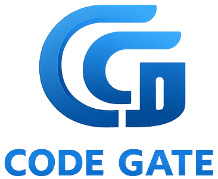
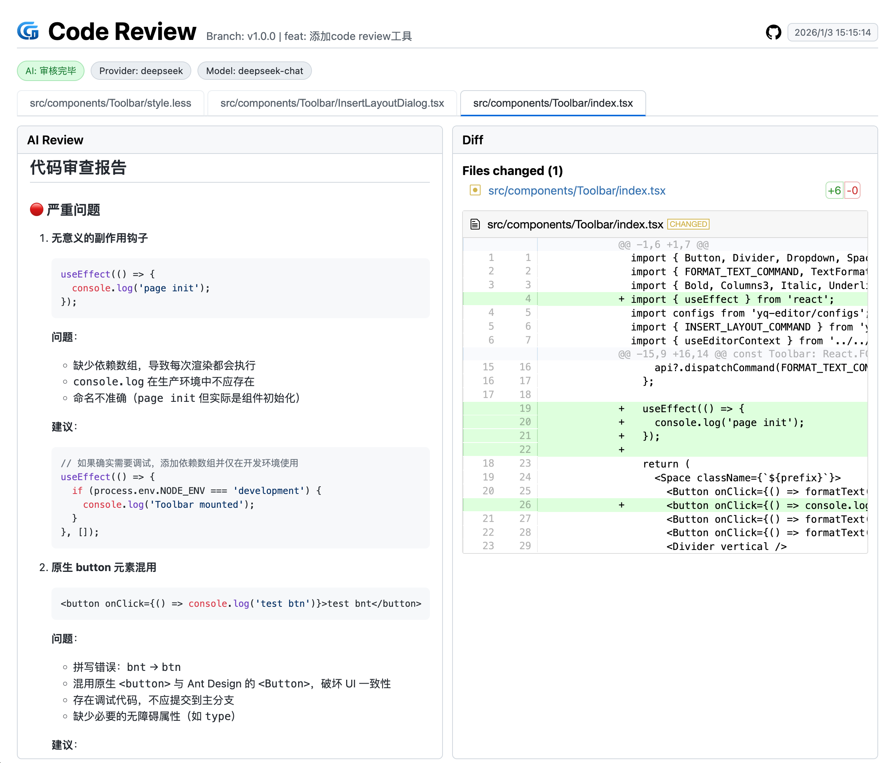
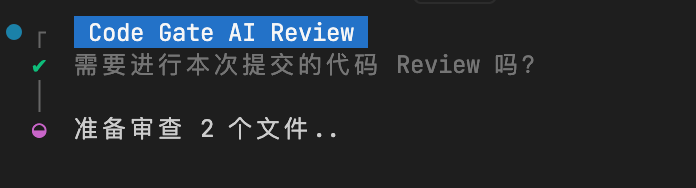

<div align="center">
  
</div>

[English](./README.md) | [简体中文](./README_ZH.md)

# Code Gate


[](https://github.com/Gil2015/code-gate/releases/latest)
[](LICENSE)

**您的轻量级本地 AI 代码审查助手**

Code Gate 是一款无缝集成到 Git 工作流中的智能代码AI审查工具。可视化展示代码变更与 AI 建议，帮助您快速定位问题并优化代码质量。

支持通过 npx 零配置运行、npm/yarn/pnpm 包管理集成以及 Git Hook 自动化审查，灵活适配各种开发工作流。

<div align="left">
  
</div>

## ✨ 核心特性

- **🔒 数据隐私优先**：原生支持 Ollama 本地模型。
- **☁️ 多模型支持**：无缝对接 DeepSeek, OpenAI, Anthropic, 阿里云 Qwen, 豆包等主流 AI 服务。
- **🌍 多语言界面**：内置中（简/繁）、英、日、韩、德、法等多语言支持。
- **⚡️ 高效并发**：智能并发处理多文件审查，提升 Review 速度。
- **🛠️ 高度可定制**：支持自定义 Prompt、文件过滤规则及审查策略。
- **📊 可视化报告**：生成直观的 HTML 审查报告，提供清晰的 Diff 对比与 AI 建议。
- **📜 审查日志**：自动保存历史审查记录，便于随时查阅与回溯。

--- 

## 🚀 快速开始
### 添加配置文件
所有方案都会依赖配置文件执行，请先在项目根目录下添加 `.codegate.js` 配置文件。
```javascript
export default {
  provider: 'ollama', // 默认使用 Ollama 本地模型，这里可以替换为其他模型如 DeepSeek
  providerOptions: {
    ollama: {
      baseURL: 'http://localhost:11434',
      model: 'qwen2.5-coder',
      concurrencyFiles: 1
    },
    deepseek: {
      baseURL: 'https://api.deepseek.com',
      apiKeyEnv: 'DEEPSEEK_API_KEY',
      model: 'deepseek-chat',
      concurrencyFiles: 4,
      apiKey: 'sk-xxxx' // 替换为您的 DeepSeek API 密钥（请不要直接暴露在公共代码中）
    }
    // openai: { baseURL: 'https://api.openai.com/v1', apiKeyEnv: 'OPENAI_API_KEY', model: 'gpt-4o-mini' },
    // anthropic: { baseURL: 'https://api.anthropic.com', apiKeyEnv: 'ANTHROPIC_API_KEY', model: 'claude-3-5-sonnet' },
    // azureOpenAI: { endpoint: 'https://your-endpoint.openai.azure.com', apiKeyEnv: 'AZURE_OPENAI_KEY', deployment: 'gpt-4o-mini', apiVersion: '2024-08-01-preview' },
    // aliyun: { baseURL: 'https://dashscope.aliyuncs.com/compatible-mode/v1', apiKeyEnv: 'DASHSCOPE_API_KEY', model: 'qwen-plus' },
    // volcengine: { baseURL: 'https://ark.cn-beijing.volces.com/api/v3', apiKeyEnv: 'VOLCENGINE_API_KEY', model: 'doubao-pro-32k' },
    // zhipu: { baseURL: 'https://open.bigmodel.cn/api/paas/v4', apiKeyEnv: 'ZHIPU_API_KEY', model: 'glm-4' }
  },
  language: 'zh-CN',
  fileTypes: ['ts', 'tsx', 'css'],
  ui: {
    openBrowser: true,
    port: 5175
  },
  limits: {
    maxDiffLines: 10000,
    maxFiles: 100
  },
  prompt: `您是一位高级代码评审员，负责确保代码质量和安全性达到高标准。

项目信息:
- [填入你项目相关信息：架构、规范、业务类型等]

评审清单：
- 代码简洁易读
- 函数和变量命名规范
- 无重复代码
- 正确的错误处理
- 已实现输入验证
- 已考虑性能因素

提供按优先级排序的反馈：
- 关键问题（必须修复）
- 警告（应该修复）
- 建议（考虑改进，不是很必要的内容不要画蛇添足增加建议）

提供具体的示例说明如何修复问题。`,
  output: {
    dir: '.review-logs'
  }
}
```

> 配置文件支持多种格式，包括: `.codegate.ts`, `.codegate.js`, `.codegate.json`, `.codegate.yaml`, `.codegate.yml` (也支持 `.mjs`, `.cjs` 扩展名)。


### 方式一：npx 零安装使用

无需安装依赖，直接审查最近一次提交（或指定 Commit）：

```bash
npx code-gate review <commit-hash>
```

或者审查暂存区的文件变更（Git Staged）：

```bash
npx code-gate review
```

### 方式二：npm 包管理集成

将 `code-gate` 作为开发依赖安装到项目中：

```bash
npm i -D code-gate
```

在 `package.json` 中添加脚本命令：

```json
{
  "scripts": {
    "review": "code-gate review"
  }
}
```

通过脚本命令手动触发审查：

```bash
# 审查暂存区变更
npm run review

# 审查特定提交
npm run review <commit-hash>
```

> 如果想要直接在命令行使用 `code-gate review`命令，可以将 `code-gate` 安装为全局依赖：`npm i -g code-gate`

### 方式三：Git Hook 自动化审查

自动拦截 `git commit` 流程(完成审核后会询问是否继续提交)。

#### 1. 安装

在项目中安装 `code-gate` 作为开发依赖：

```bash
npm i -D code-gate
```

#### 2. 初始化

您可以使用一键初始化命令，自动配置 Git Hooks，也可以手动配置。

**2.1 自动初始化（推荐）**

```bash
# 交互式选择 Git Hooks 或 Husky
npx code-gate init
```

如果您已明确使用某种 Hook 管理方式，可以指定对应参数：

- **原生 Git Hooks**: `npx code-gate init -m git`
- **Husky**: `npx code-gate init -m husky`

> 初始化完成后，您可选择将生成的配置文件添加到 `.gitignore` 中。

**2.2 手动配置**

您也可以手动配置 Git Hooks，在pre-commit文件中添加（如项目根目录`.githooks/pre-commit`文件中）：
```bash
#!/usr/bin/env sh
./node_modules/.bin/code-gate-hook
```

#### 3. 自动触发

只需像往常一样提交代码，Code Gate 会自动启动审查：

```bash
git add .
git commit -m "feat: new feature"
```
<div align="left" style="margin-left: 20px">
   
</div>


---

## 📖 配置详解

| 参数 | 类型 | 默认值 | 说明 |
| :--- | :--- | :--- | :--- |
| `provider` | `string` | `'ollama'` | 选择使用的 AI 审查引擎。可选值: `'ollama'`, `'deepseek'`, `'openai'`, `'anthropic'`, `'aliyun'`, `'volcengine'`, `'zhipu'` 等 |
| `providerOptions` | `object` | `{}` | 各 Provider 的具体配置集合（见下表） |
| `fileTypes` | `string[]` | `[]` | 需要审查的文件类型扩展名列表（白名单）。若为空数组或未配置，则审查所有文件。 |
| `exclude` | `string[]` | `['**/package-lock.json', '**/yarn.lock', '**/pnpm-lock.yaml']` | 不需要审查的文件或目录列表（黑名单），支持 glob 模式匹配（如 `node_modules/**`）。优先级高于 `fileTypes`。 |
| `ui.openBrowser` | `boolean` | `true` | 是否自动打开浏览器预览 |
| `ui.port` | `number` | `5175` | 预览服务端口 |
| `limits.maxDiffLines` | `number` | `10000` | 最大 diff 行数，超出限制可能导致审查不完整或消耗过多 Token |
| `limits.maxFiles` | `number` | `100` | 最大审查文件数 |
| `reviewMode` | `string` | `'files'` | 审查模式：`'summary'` (仅汇总), `'files'` (仅文件详情), `'both'` (两者都有) |
| `language` | `string` | `'en'` | 界面与 Prompt 语言。可选值：`'en'`, `'zh-CN'`, `'zh-TW'`, `'ja'`, `'ko'`, `'de'`, `'fr'` |
| `prompt` | `string` | `...` | 发送给 AI 的通用系统提示词 |
| `output.dir` | `string` | `'.review-logs'` | 本地生成报告和静态资源的输出目录 |

### providerOptions 配置
每个 Provider 可配置以下字段，支持 `request` 选项控制请求超时与重试。

**关键参数说明：**
- `baseURL`: API 基础地址（如 `https://api.deepseek.com` 或 `http://localhost:11434`）
- `apiKey`: API 密钥（直接在配置中指定，不推荐提交到仓库）
- `apiKeyEnv`: 存储 API 密钥的环境变量名称（推荐方式，如 `DEEPSEEK_API_KEY`）
- `model`: 使用的模型名称（如 `deepseek-chat`, `qwen2.5-coder`）
- `concurrencyFiles`: 并发审查的文件数量（建议云端 API 设置 4-8，本地ollama模型设置 1）
- `request`: 高级请求配置（见下表“高级配置”）

| Provider | 可配置参数 |
| :--- | :--- |
| **ollama** | `baseURL`, `model`, `concurrencyFiles`, `request` |
| **deepseek** | `baseURL`, `apiKey`, `apiKeyEnv`, `model`, `concurrencyFiles`, `request` |
| **openai** | `baseURL`, `apiKey`, `apiKeyEnv`, `model`, `request` |
| **anthropic** | `baseURL`, `apiKey`, `apiKeyEnv`, `model`, `request` |
| **aliyun** | `baseURL`, `apiKey`, `apiKeyEnv`, `model`, `request` |
| **volcengine** | `baseURL`, `apiKey`, `apiKeyEnv`, `model`, `request` |
| **zhipu** | `baseURL`, `apiKey`, `apiKeyEnv`, `model`, `request` |
| **azureOpenAI** | `endpoint`, `apiKey`, `apiKeyEnv`, `deployment`, `apiVersion`, `request` |

#### 高级配置 (request)
在 `providerOptions.<provider>.request` 中配置，用于控制请求行为：

| 参数 | 类型 | 默认值 | 说明 |
| :--- | :--- | :--- | :--- |
| `timeout` | `number` | `undefined` | 请求超时时间（毫秒）。Ollama 默认建议设大一些（如 15000+） |
| `retries` | `number` | `0` | 请求失败重试次数 |
| `backoffMs` | `number` | `300` | 重试间隔时间（毫秒） |

> **注意**：`concurrencyFiles` 控制并发审查的文件数（默认 DeepSeek=4, Ollama=1, 其他=4）。

### API Key 配置方案

根据自己项目需要，选择合适的配置方案。这里以deepseek为例。
为了安全起见，建议不要将 API Key 暴露到公共仓库中。

**方案 A：配置文件中**

在 `.codegate.js` 中设置：

```javascript
export default {
  providerOptions: {
    deepseek: {
      // ...其他配置
      apiKey: 'your-deepseek-api-key'
    }
  }
}
```

**方案 B：Git Hook 注入**

在 `.githooks/pre-commit` 或 `.husky/pre-commit` 中临时导出：

```bash
#!/bin/sh
export DEEPSEEK_API_KEY=[your-deepseek-api-key]
./node_modules/.bin/code-gate-hook
```

**方案 C：环境变量**

在 `.env` 文件或系统环境变量中设置：

```bash
export DEEPSEEK_API_KEY=[your-deepseek-api-key]
```

---

## ❓ 常见问题

**Q: 页面显示 Diff 但没有 AI 建议？**
- 检查 `provider` 配置是否正确。
- 若使用 Ollama，请确保本地服务已启动 (`ollama serve`) 且模型已下载 (`ollama pull qwen2.5-coder`)。
- 若使用云端 API，请检查 API Key 是否有效及网络连接。

**Q: 如何在 CI/CD 中跳过审查？**
Code Gate 会自动检测交互式环境。在 CI 环境中通常会自动跳过。如需强制跳过，可使用 `git commit --no-verify`。

## 📄 License

MIT
